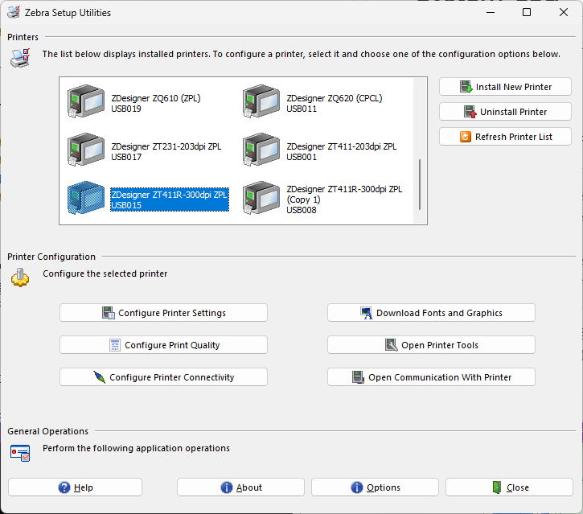
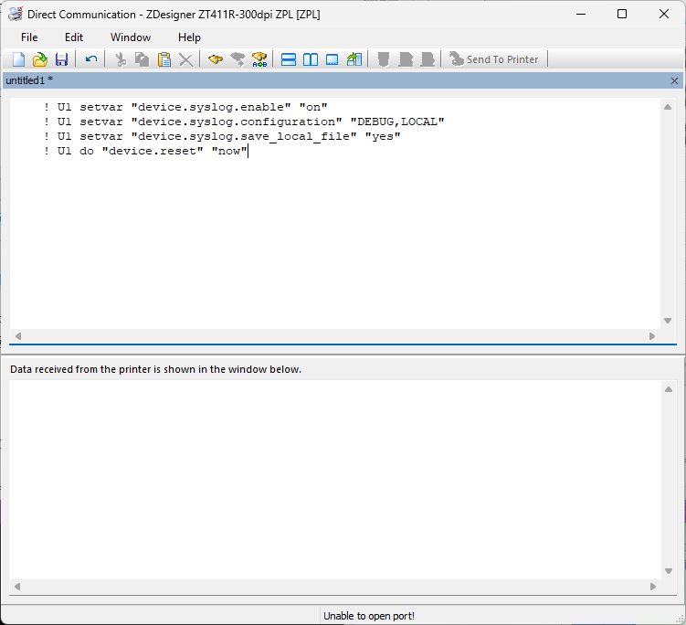
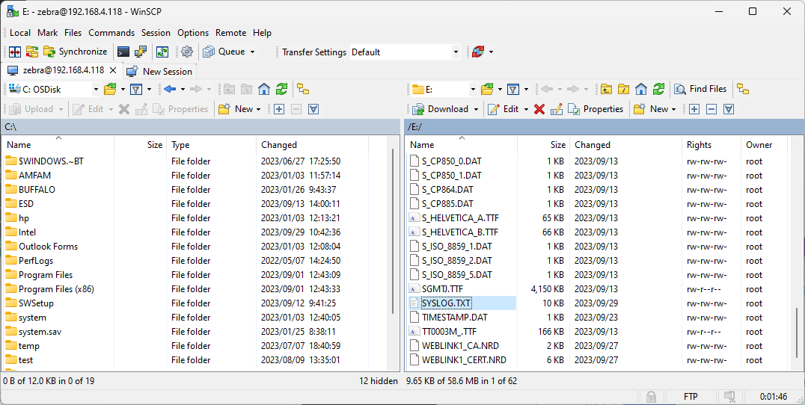

# Zebra-Printer_Trouble-Shooting_Set-and-Collect-System-Log
### トラブル時に取得すべきプリンタの設定情報（Syslog版）

---

 コマンドの詳細はAppleNote-SYSLOG-v4.pdfを参照すること。
 [Link-OS® Printer Operating System Syslog AppNote 2456935.546169](https://www.zebra.com/content/dam/zebra/software/en/application-notes/AppNote-SYSLOG-v4.pdf)

 

### Syslog 設定方法

1. Zebra Setup Utility を起動。

1. 対象のプリンタを選択。 

    

1. [Open Communication with Printer] を選択。

1. 下記コマンコマンドを実行。

        ! U1 setvar "device.syslog.enable" "on"
        ! U1 setvar "device.syslog.configuration" "DEBUG,LOCAL"
        ! U1 setvar "device.syslog.save_local_file" "yes"
        ! U1 do "device.reset" "now"

    ***※ コマンド実行の際は最終行の後に必ずエンター（CR/LF）を入れること！***

     

    

1. プリンタが再起動する。  
    ※ 再起動しない場合は手順を見直して、手順を最初から再実行。

     

### Syslog 確認方法

1. 下記コマンドを実行。

        ! U1 do "file.dir" "E:SYSLOG.TXT"

1. E:SYSLOG.TXTが存在することを確認する。

        - DIR E:*.* 
        * E:ANMDJ.TTF  22927536          
        * E:CGTRI_N.FNT     45407          
        -- 略
        * E:SGMTJ.TTF   4248848          
        * E:SYSLOG.TXT      9984  ★
        * E:S_CP737.DAT      1024          
        * E:S_CP850_0.DAT      1024  

     

### Syslog.txt取得方法 (FTPを用いる方法)

1. FTPクライアントでプリンタに接続し、Syslog.txtをダウンロードください。

        Default User: zebra  
        Default Pass: 1234

    ▼ 例、WinSCPにてプリンタに接続

    

     

※FTPを用いた方法が難しい場合はUSBメモリやコマンドを用いてファイル情報を取得ください。

コマンド例、  

        ! U1 do "file.type" "E:[ファイル名]"

